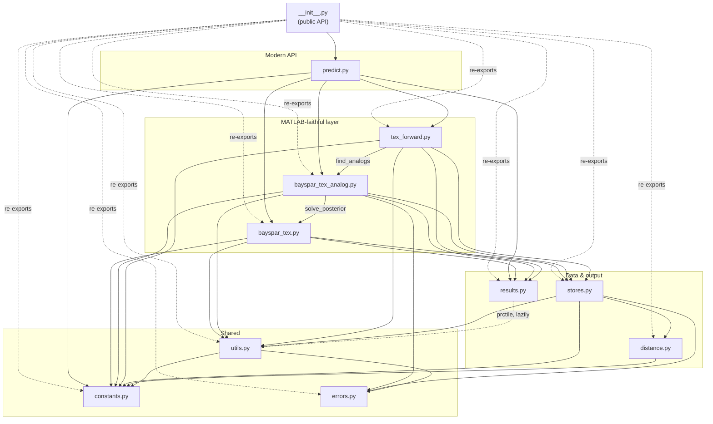
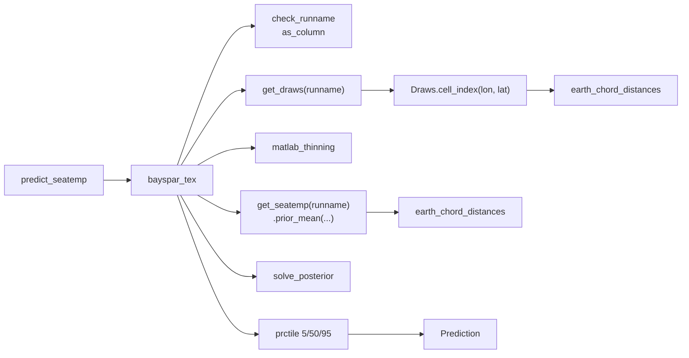
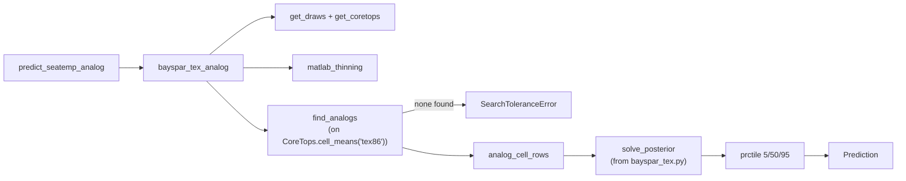
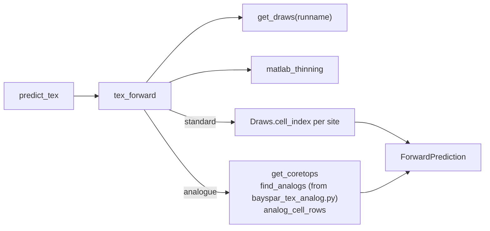
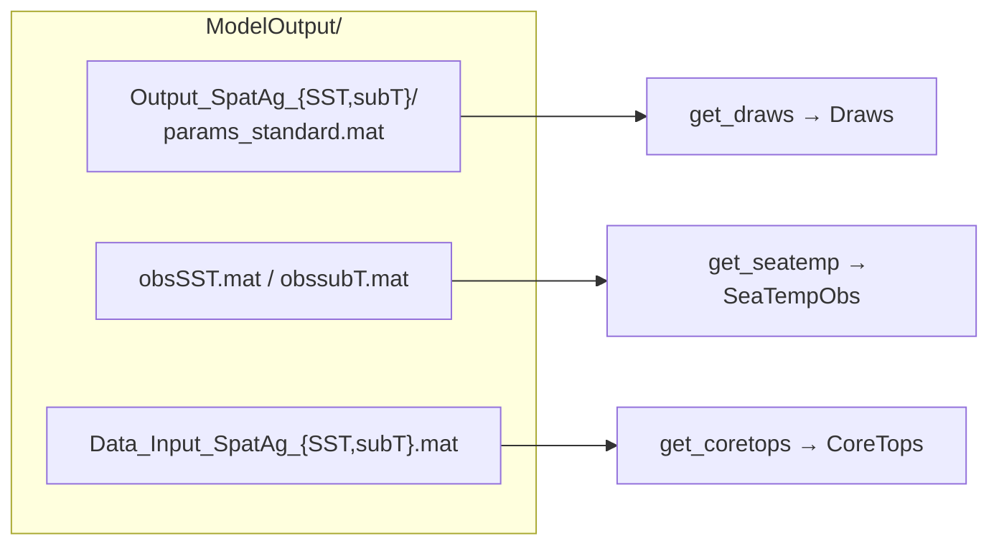
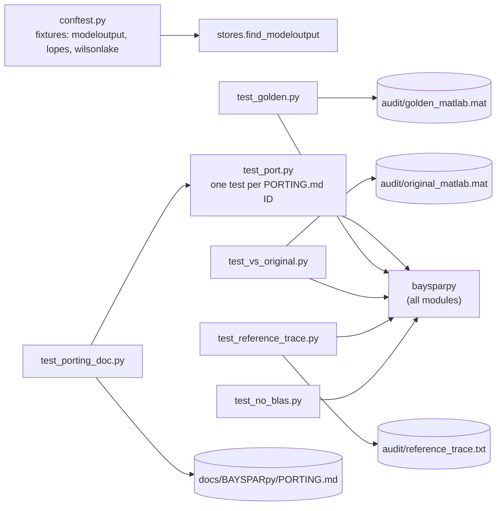

# BAYSPARpy site map

How the modules in `src/baysparpy/` depend on each other, which MATLAB file each
one ports, what data they read, and which tests exercise them.

The line-by-line translation record lives in `docs/BAYSPARpy/PORTING.md` at the
root of the BAYSPAR repository. IDs such as `BT-06` in the docstrings refer to it.

## Modules at a glance

| Module | Layer | Ports | Role |
|---|---|---|---|
| `__init__.py` | package | — | Re-exports the public API |
| `predict.py` | modern API | — | `predict_seatemp`, `predict_seatemp_analog`, `predict_tex`: thin, keyword-friendly wrappers |
| `bayspar_tex.py` | MATLAB-faithful | `bayspar_tex.m` | Standard mode: TEX86 → temperature at a known site. Also holds `solve_posterior` |
| `bayspar_tex_analog.py` | MATLAB-faithful | `bayspar_tex_analog.m` | Analogue mode: TEX86 → temperature, ignoring location. Also holds `find_analogs` |
| `tex_forward.py` | MATLAB-faithful | `TEX_forward.m` | Forward model: temperature → TEX86 |
| `distance.py` | MATLAB-faithful | `EarthChordDistances_2.m` | `earth_chord_distances` |
| `stores.py` | data | the `load` calls | Finds `ModelOutput/` and reads the `.mat` files into `Draws`, `SeaTempObs`, `CoreTops` (cached) |
| `results.py` | output | `Output_Struct` | `Prediction`, `ForwardPrediction` dataclasses |
| `utils.py` | shared | small MATLAB idioms | `as_column`, `matlab_thinning`, `prctile`, `check_runname` |
| `constants.py` | shared | hard-coded numbers | `EARTH_RADIUS_KM`, `GRID_HALF_SPACE`, `MAX_DIST_KM`, `MIN_NUM`, `DEFAULT_N_DRAWS`, `RUNNAMES`, … |
| `errors.py` | shared | MATLAB `error(...)` | `BaysparError` and its three subclasses |

## Import graph

An arrow `A --> B` means *A imports from B*. Modules higher up depend on those
below; nothing points upward, so there are no import cycles.

Two links cross between the three ported functions, and both reuse a shared step
instead of copying it:

- `bayspar_tex_analog` calls `bayspar_tex.solve_posterior` for the conjugate normal update.
- `tex_forward` calls `bayspar_tex_analog.find_analogs` for its analogue cell search.

## Call flow for each entry point

### Standard mode: `predict_seatemp` / `bayspar_tex`

### Analogue mode: `predict_seatemp_analog` / `bayspar_tex_analog`

### Forward model: `predict_tex` / `tex_forward`

## Data files read by `stores.py`

`find_modeloutput()` uses `$BAYSPAR_MODELOUTPUT` if it is set. Otherwise it
walks up from the package to the first `ModelOutput/` that contains
`obsSST.mat`. Every file is loaded once and cached (`lru_cache`).

`params_analog.mat` is never read. It is bit-identical to a subset of rows in
`params_standard.mat`, and `analog_cell_rows` selects those rows (PORTING.md STO-01).

## Tests

| Test file | Checks |
|---|---|
| `test_port.py` | Each deliberate MATLAB → Python decision, one test per PORTING.md ID |
| `test_golden.py` | Output matches values generated in MATLAB by `audit/generate_golden.m` |
| `test_vs_original.py` | Output matches the original, unmodified MATLAB functions (`audit/verify_original.m`) |
| `test_reference_trace.py` | Intermediate values match `audit/reference_trace.txt` |
| `test_no_blas.py` | The closed-form path never calls a threaded BLAS |
| `test_porting_doc.py` | Every PORTING.md ID has a test and every test ID exists in PORTING.md |

The `audit/` paths are under `docs/BAYSPARpy/` in the BAYSPAR repository.

## Notebook

`notebooks/compare_implementations.ipynb` imports `baysparpy as ours` and,
when it is installed, `bayspar as brews`. It runs both on Jess Tierney's two
demos and compares them against the MATLAB results in
`audit/original_matlab.mat`.
